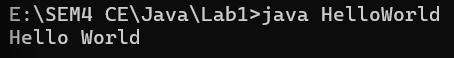
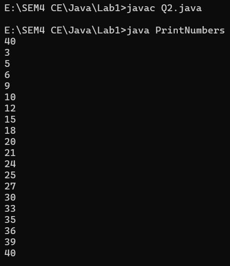
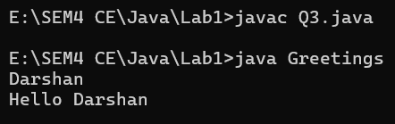
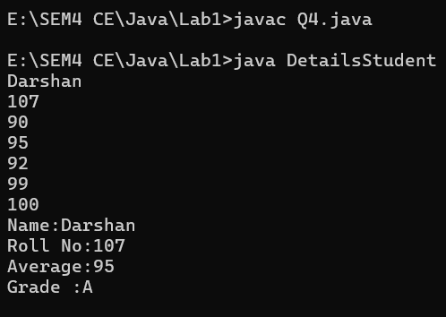
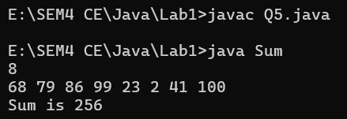
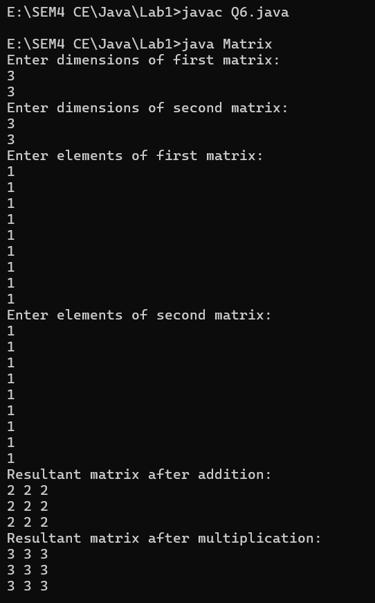

# Lab1

# Topics: print(), println(), Scanner class, 1-D, 2-D array, jagged array

<!-- TOC -->

- [Question 1](#question-1)
- [Question 2](#question-2)
- [Question 3](#question-3)
- [Question 4](#question-4)
- [Question 5](#question-5)
- [Question 6](#question-6)

<!-- TOC -->

## Question 1

- Write a Java program to display “Hello World”.

> Code

```java
import java.util.*;

class HelloWorld {
    public static void main(String args[]) {
        System.out.println("Hello World");
    }
}
```



---

## Question 2

- Write a Java program to print numbers between 1 to n which are divisible by 3, 5 and
  by both(3 and 5) by taking n as an input from the user.

> Code

```java
import java.util.*;

class PrintNumbers {
    public static void main(String args[]) {
        int n;
        Scanner sc = new Scanner(System.in);
        n = sc.nextInt();
        for (int i = 1; i <= n; i++) {
            if (i % 3 == 0 || i % 5 == 0)
                System.out.println(i);
        }
    }
}
```



---

## Question 3

- Write a class named Greeter that prompts the user for his or her name, and then prints
  a personalized greeting. As an example, if the user entered &quot;Era&quot;, the program should
  respond &quot;Hello Era!&quot;.

> Code

```java
import java.util.*;

class Greetings {
    public static void main(String args[]) {
        Scanner sc = new Scanner(System.in);
        String name;
        name = sc.nextLine();
        System.out.println("Hello " + name);
    }
}
```



---

## Question 4

- Write a Java program that takes Name, Roll No and marks of 5 subjects as input and
  gives a formatted output as:
  Name: ABCD
  Roll No. : 1
  Average: 84
  Also display the grade (e.g. A, B, C…etc) using the average.

> Code

```java
import java.util.*;

class DetailsStudent {
    public static void main(String args[]) {
        Scanner sc = new Scanner(System.in);
        String name;
        int rollNo;
        List<Integer> li = new ArrayList<>();
        name = sc.nextLine();
        rollNo = sc.nextInt();
        for (int i = 0; i < 5; i++) {
            li.add(sc.nextInt());
        }
        int sum = 0;
        int avg = 0;
        for (int i = 0; i < 5; i++)
            sum += li.get(i);
        avg = sum / 5;
        System.out.println("Name:" + name);
        System.out.println("Roll No:" + rollNo);
        System.out.println("Average:" + avg);
        if (avg > 90) {
            System.out.println("Grade :A");
        } else if (avg < 90 && avg > 75) {
            System.out.println("Grade :B");
        } else if (avg < 75 && avg > 60) {
            System.out.println("Grade :C");
        } else
            System.out.println("Grade :F");
    }
}
```



---

## Question 5

- Calculate and return the sum of all the even numbers present in the numbers array
  passed to the method calculateSumOfEvenNumbers. Implement the logic inside
  calculateSumOfEvenNumbers() method.
  Test the functionalities using the main() method of the Tester class.

> Code

```java
import java.util.*;

class Sum {
    static public int calculateSumOfEvenNumbers(int arr[]) {
        int sum = 0;
        for (int i = 0; i < arr.length; i++) {
            if (arr[i] % 2 == 0)
                sum += arr[i];
        }
        return sum;
    }

    public static void main(String args[]) {
        Scanner sc = new Scanner(System.in);
        int n = sc.nextInt();
        int arr[];
        arr = new int[n];
        for (int i = 0; i < n; i++) {
            arr[i] = sc.nextInt();
        }
        int ans = Sum.calculateSumOfEvenNumbers(arr);
        System.out.println("Sum is " + ans);
    }
}
```



---

## Question 6

- Write a program to perform matrix addition and matrix multiplication on two given
  matrices. Use for-each form of for loop to display the matrices.

> Code

```java
import java.util.*;

class Matrix {
    static public int[][] Addition(int mat1[][], int mat2[][]) {
        int row1 = mat1.length;
        int col1 = mat1[0].length;
        int row2 = mat2.length;
        int col2 = mat2[0].length;

        if (row1 != row2 || col1 != col2) {
            System.out.println("Not a valid matrix");
            int[][] o = null;
            return o;
        }

        int[][] result = new int[row1][col1];
        for (int i = 0; i < row1; i++) {
            for (int j = 0; j < col1; j++) {
                result[i][j] = mat1[i][j] + mat2[i][j];
            }
        }
        return result;
    }


    static public int[][] Multiplication(int mat1[][], int mat2[][]) {
        int row1 = mat1.length;
        int col1 = mat1[0].length;
        int row2 = mat2.length;
        int col2 = mat2[0].length;

        if (col1 != row2) {
            System.out.println("Matrices cannot be multiplied");
            return null;
        }

        int[][] result = new int[row1][col2];
        for (int i = 0; i < row1; i++) {
            for (int j = 0; j < col2; j++) {
                for (int k = 0; k < col1; k++) {
                    result[i][j] += mat1[i][k] * mat2[k][j];
                }
            }
        }
        return result;
    }

    public static void main(String args[]) {
        Scanner sc = new Scanner(System.in);
        int row1, col1;
        int row2, col2;
        System.out.println("Enter dimensions of first matrix:");
        row1 = sc.nextInt();
        col1 = sc.nextInt();
        System.out.println("Enter dimensions of second matrix:");
        row2 = sc.nextInt();
        col2 = sc.nextInt();

        if (row1 != row2 || col1 != col2) {
            System.out.println("Matrices dimensions do not match");
            return;
        }

        int[][] mat1 = new int[row1][col1];
        int[][] mat2 = new int[row2][col2];

        System.out.println("Enter elements of first matrix:");
        for (int i = 0; i < row1; i++) {
            for (int j = 0; j < col1; j++) {
                mat1[i][j] = sc.nextInt();
            }
        }

        System.out.println("Enter elements of second matrix:");
        for (int i = 0; i < row2; i++) {
            for (int j = 0; j < col2; j++) {
                mat2[i][j] = sc.nextInt();
            }
        }

        int[][] add = Addition(mat1, mat2);
        int[][] mul = Multiplication(mat1, mat2);

        System.out.println("Resultant matrix after addition:");
        for (int i = 0; i < add.length; i++) {
            for (int j = 0; j < add[0].length; j++) {
                System.out.print(add[i][j] + " ");
            }
            System.out.println();
        }
        System.out.println("Resultant matrix after multiplication:");
        for (int i = 0; i < mul.length; i++) {
            for (int j = 0; j < mul[0].length; j++) {
                System.out.print(mul[i][j] + " ");
            }
            System.out.println();
        }
    }
}
```



---
> ### END OF DOCUMENT