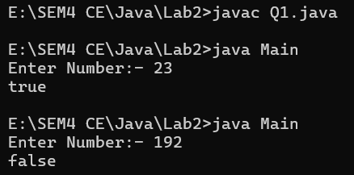
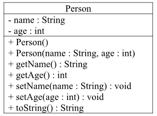
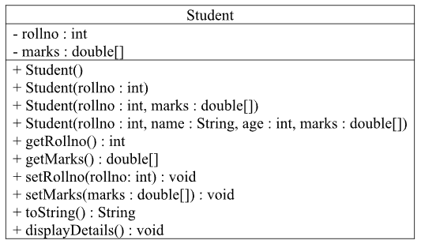
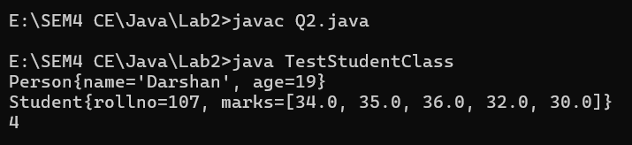

# Lab1

# Topics: Inheritance, Polymorphism(method overriding), static keyword

---
<!-- TOC -->
* [Q1](#q1)
* [Q2](#q2)

<!-- TOC -->
---

## Q1

- Write a Java program that checks for prime number using the object oriented approach.
- \[Hint: create a class NumberClass with a member value and method isPrimeNumber()]

> Code

```java
import java.util.*;
import java.io.*;

/*Darshan Kania*/
class NumberClass {
    private int number;

    public NumberClass(int num) {
        number = num;
    }

    public Boolean isPrimeNumber() {
        for (int i = 2; i <= number / 2; i++) {
            if (number % i == 0) {
                return false;
            }
        }
        return true;
    }
}

public class Q1 {
    public static void main(String args[]) {
        int numCheck;
        Scanner sc = new Scanner(System.in);
        System.out.print("Enter Number:- ");
        numCheck = sc.nextInt();
        NumberClass Obj = new NumberClass(numCheck);
        System.out.println(Obj.isPrimeNumber());
    }
}
```

> Input and Output

- 

---

## Q2

- Create two classes:
    - class Person
    - Derive a class Student from class Person.
- 
- 
- Add the following to Student class:
    - a static variable count( to count the number of objects)
    - a static block to initialize count variable to zero
    - a static method String getCount() that returns the number of student objects created
    - Write a TestStudent class containing the main() method.
    - Store the details of 3 students by creating an array of objects of Student class and display
      the student who has highest average amongst the three students as follows using
      displayDetails() method for that object:
      ```text e.g.
      RollNo = 100
      Name = ABC
      Age = 20
      Marks=78 86 88 67 92
      ```
    - Create one more object of the Student class and then call the getCount() to display the
      number of Student objects created.
  > CODE
    ```java
    import java.util.Arrays;
    
    /*Darshan Kania*/
    class Person {
        private String name;
        private int age;
    
        public Person() {
        }
    
        public Person(final String name, final int age) {
            this.name = name;
            this.age = age;
        }
    
        public String getName() {
            return this.name;
        }
    
        public int getAge() {
            return this.age;
        }
    
        public void setName(final String name) {
            this.name = name;
        }
    
        public void setAge(final int age) {
            this.age = age;
        }
    
        @Override
        public String toString() {
            return "Person{" +
                    "name='" + name + '\'' +
                    ", age=" + age +
                    '}';
        }
    }
    
    class Student extends Person {
        private int rollno;
        private double marks[];
        static int count;
    
        static {
            count = 0;
        }
    
        {
            count++;
            marks = new double[5];
        }
    
    
        public Student() {
            this.marks = null;
        }
    
        public Student(final int rollno) {
            this.rollno = rollno;
        }
    
        public Student(final double[] marks, final int rollno) {
            this.marks = marks;
            this.rollno = rollno;
        }
    
        public Student(final String name, final int age, final int rollno, final double[] marks) {
            super(name, age);
            this.rollno = rollno;
            this.marks = marks;
        }
    
        public static int getCount() {
            return Student.count;
        }
    
        public int getRollno() {
            return this.rollno;
        }
    
        public void setRollno(final int rollno) {
            this.rollno = rollno;
        }
    
        public double[] getMarks() {
            return this.marks;
        }
    
        public void setMarks(final double[] marks) {
            this.marks = marks;
        }
    
        @Override
        public String toString() {
            System.out.println(super.toString());
            return "Student{" +
                    "rollno=" + rollno +
                    ", marks=" + Arrays.toString(marks) +
                    '}';
        }
    
        public void displayDetails(Student std[]) {
            Student highest = null;
            double highestTotal = 0;
            for (Student st : std) {
                double sum = 0;
                for (double marks : st.getMarks()) {
                    sum += marks;
                }
                if (sum / 5 > highestTotal) {
                    highestTotal = sum / 5;
                    highest = st;
                }
            }
            System.out.println(highest.toString());
        }
    }
    
    class TestStudentClass {
        public static void main(String args[]) {
            Student[] stdDetails = new Student[]{
                    new Student("Darshan", 19, 107, new double[]{34, 35, 36, 32, 30}),
                    new Student("Hirav", 19, 121, new double[]{30, 32, 34, 35, 32}),
                    new Student("Rut", 18, 112, new double[]{36, 32, 31, 30, 30})
            };
            Student st;//It will not increment count as memory not made.
            Student DDUStds = new Student();
            DDUStds.displayDetails(stdDetails);
            System.out.println(Student.getCount());
        }
    }
    ```
  > Output of Code
    - 

---
> ### END OF DOCUMENT