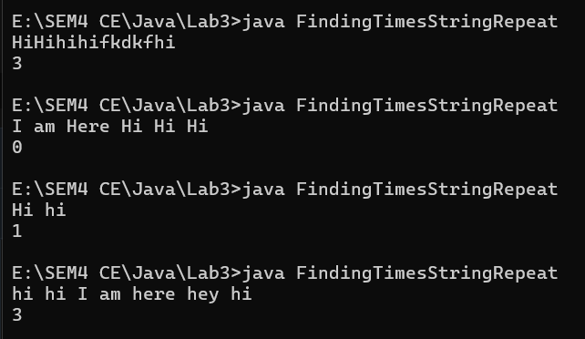
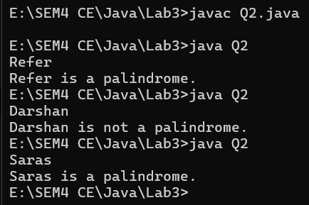
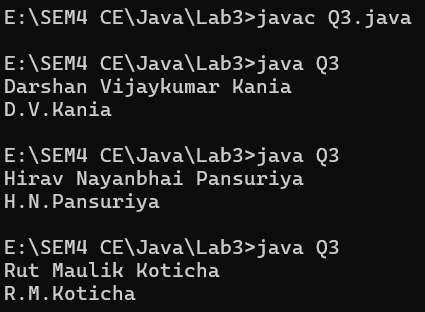

# Lab3

> Topics: String, StringBuffer, StringBuilder, array of objects, this keyword,
> constructor overloading
---

## Q1

- Write a program that returns the number of times that the string “hi” appears anywhere in
  the given string

> CODE

```java
import java.util.Scanner;

class FindingTimesStringRepeat {
    public static void main(String args[]) {
        Scanner sc = new Scanner(System.in);
        String str = sc.nextLine();
        System.out.println(TimesHi(str));
    }

    public static int TimesHi(String str) {
        int count = 0;
        for (int i = 0; i < str.length() - 1; i++) {
            if (str.charAt(i) == 'h' && str.charAt(i + 1) == 'i') {
                count++;
            }
        }
        return count;
    }
}
```

> Input Output

---

## Q2

- Write a program which checks whether the input string is palindrome or not and then
  display an appropriate message [e.g. “Refer” is a palindrome string].

> CODE

```java

import java.util.Scanner;

/*Darshan Kania*/
class Q2 {
    public static boolean isPalindrome(String str) {
        String dummy = new String();
        dummy = str.toLowerCase();
        int end = dummy.length() - 1;
        int start = 0;
        while (start < end) {
            if (dummy.charAt(start) != dummy.charAt(end))
                return false;
            else {
                start++;
                end--;
            }
        }
        return true;
    }

    public static void main(String args[]) {
        Scanner sc = new Scanner(System.in);
        String str = sc.nextLine();
        boolean result = isPalindrome(str);
        if (result) {
            System.out.printf("%s is a palindrome.", str);
        } else {
            System.out.printf("%s is not a palindrome.", str);
        }
    }

}
```

> Input Output

- 

---

## Q3

- Write a program that takes your full name as input and displays the abbreviations of the
  first and middle names except the last name which is displayed as it is. For example, if
  your name is Robert Brett Roser, then the output should be R.B.Roser.

> CODE

```java
import java.util.Scanner;

/*Darshan Kania*/
class Q3 {
    public static String shortFullName(String str[]) {
        String ans = new String();
        for (int i = 0; i < str.length - 1; i++) {
            ans += str[i].charAt(0) + ".";
        }
        ans += str[str.length - 1];
        return ans;
    }

    public static void main(String args[]) {
        String name[] = new String[3];
        Scanner sc = new Scanner(System.in);
        for (int i = 0; i < name.length; i++) {
            name[i] = sc.next();
        }
        System.out.println(shortFullName(name));
    }
}
```

> Input Output

- 
---
## Q4
- Write  a  method  String  removeWhiteSpaces(String  str)  method  that  removes  all  the
  white  spaces  from  the  string  passed  to  the  method  and  returns  the  modified  string.  Test
  the functionalities using the main() method of the Tester class. 
