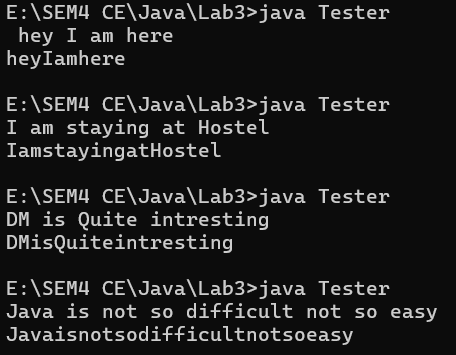
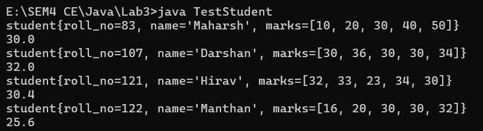

# Lab3
---
> Topics: String, StringBuffer, StringBuilder, array of objects, this keyword,
> constructor overloading
---

## Q1

- Write a program that returns the number of times that the string “hi” appears anywhere in
  the given string

> CODE

```java
import java.util.Scanner;

class FindingTimesStringRepeat {
    public static void main(String args[]) {
        Scanner sc = new Scanner(System.in);
        String str = sc.nextLine();
        System.out.println(TimesHi(str));
    }

    public static int TimesHi(String str) {
        int count = 0;
        for (int i = 0; i < str.length() - 1; i++) {
            if (str.charAt(i) == 'h' && str.charAt(i + 1) == 'i') {
                count++;
            }
        }
        return count;
    }
}
```

> Input Output

---

## Q2

- Write a program which checks whether the input string is palindrome or not and then
  display an appropriate message [e.g. “Refer” is a palindrome string].

> CODE

```java

import java.util.Scanner;

/*Darshan Kania*/
class Q2 {
    public static boolean isPalindrome(String str) {
        String dummy = new String();
        dummy = str.toLowerCase();
        int end = dummy.length() - 1;
        int start = 0;
        while (start < end) {
            if (dummy.charAt(start) != dummy.charAt(end))
                return false;
            else {
                start++;
                end--;
            }
        }
        return true;
    }

    public static void main(String args[]) {
        Scanner sc = new Scanner(System.in);
        String str = sc.nextLine();
        boolean result = isPalindrome(str);
        if (result) {
            System.out.printf("%s is a palindrome.", str);
        } else {
            System.out.printf("%s is not a palindrome.", str);
        }
    }

}
```

> Input Output

- 

---

## Q3

- Write a program that takes your full name as input and displays the abbreviations of the
  first and middle names except the last name which is displayed as it is. For example, if
  your name is Robert Brett Roser, then the output should be R.B.Roser.

> CODE

```java
import java.util.Scanner;

/*Darshan Kania*/
class Q3 {
    public static String shortFullName(String str[]) {
        String ans = new String();
        for (int i = 0; i < str.length - 1; i++) {
            ans += str[i].charAt(0) + ".";
        }
        ans += str[str.length - 1];
        return ans;
    }

    public static void main(String args[]) {
        String name[] = new String[3];
        Scanner sc = new Scanner(System.in);
        for (int i = 0; i < name.length; i++) {
            name[i] = sc.next();
        }
        System.out.println(shortFullName(name));
    }
}
```

> Input Output

- 

---

## Q4

- Write a method String removeWhiteSpaces(String str)  method that removes all the
  white spaces from the string passed to the method and returns the modified string. Test
  the functionalities using the main() method of the Tester class.

> CODE

```java
import java.util.Scanner;

/*Darshan Kania*/
class Tester {
    public static String whiteSpaceRemover(String str) {
        return str.replaceAll("\\s", "");
    }

    public static void main(String args[]) {
        Scanner sc = new Scanner(System.in);
        String str = sc.nextLine();
        System.out.println(whiteSpaceRemover(str));
    }
}
```

> Input Output

- 

---

## Q5

- Write a class Student with member variables int roll_no, String name and an array to store
  marks of 5 subjects. Demonstrate constructor overloading and use this keyword. Write a
  findAverage()  method that returns double value. Write a TestStudent class containing
  main() method to do the following:
    - Store the details of one student by creating one object of Student class and display
      them.
    - Store the details of 3 students by creating an array of objects of Student class and
      display the details of the student who has the highest average amongst the three
      students.

> CODE

```java
import java.util.Arrays;

/*Darshan Kania*/
class student {
    private int roll_no;
    private String name;
    private int marks[];

    {
        marks = new int[5];
        name = new String();
    }

    public student(final int roll_no, final String name, final int[] marks) {
        this.roll_no = roll_no;
        this.name = name;
        this.marks = marks;
    }

    public student() {
    }

    public student(final int[] marks) {
        this.marks = marks;
    }

    public double findAverage() {
        double sum = 0;
        for (int i = 0; i < marks.length; i++) {
            sum += marks[i];
        }
        return sum / marks.length;
    }

    @Override
    public String toString() {
        return "student{" +
                "roll_no=" + roll_no +
                ", name='" + name + '\'' +
                ", marks=" + Arrays.toString(marks) +
                '}';
    }
}

class TestStudent {
    public static void main(String args[]) {
        student std = new student(83, "Maharsh", new int[]{10, 20, 30, 40, 50});
        System.out.println(std.toString());
        System.out.println(std.findAverage());
        student stds[] = new student[]{new student(107, "Darshan", new int[]{30, 36, 30, 30, 34}), new student(121, "Hirav", new int[]{32, 33, 23, 34, 30}), new student(122, "Manthan", new int[]{16, 20, 30, 30, 32})};
        for (student s : stds) {
            System.out.println(s.toString());
            System.out.println(s.findAverage());
        }
    }
}
```

> Input Output

- 

---
> END OF DOCUMENT
---